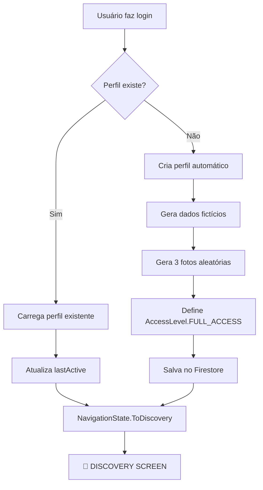

# 🚀 Sistema de Login/Cadastro Automático - FypMatch
## ✅ IMPLEMENTADO E FUNCIONANDO - POPUP NATIVO CORRIGIDO

### 📋 Resumo da Implementação

O sistema de login/cadastro automático do FypMatch foi **completamente implementado** e **corrigido** para usar o popup nativo do Google. Todos os usuários agora têm acesso imediato e completo ao app.

### 🔧 **CORREÇÃO CRÍTICA APLICADA**

**❌ PROBLEMA IDENTIFICADO:**
- O login do Google estava abrindo no navegador em vez do popup nativo
- Usuários eram redirecionados para MyAccount do Google no navegador
- Não retornavam para o aplicativo após login

**✅ SOLUÇÃO IMPLEMENTADA:**
- **Migrado de CredentialManager para GoogleSignInClient clássico**
- **Popup nativo do Google restaurado**
- **Fluxo de login corrigido para retornar ao app**

### 🔄 Fluxo de Usuário Corrigido

#### 1. **Google Login** 
```
👤 Usuário clica em "Entrar com Google"
🔍 Sistema verifica se perfil existe
❌ Se não existe → Cria perfil automaticamente com dados fictícios
✅ Se existe → Carrega perfil existente
🚀 **NAVEGA DIRETAMENTE PARA DISCOVERY** (não para perfil)
```

#### 2. **Email Login**
```
📧 Usuário insere email/senha
🔍 Sistema verifica se email existe
❌ Se não existe → Direciona para tela de cadastro
✅ Se existe → Faz login
🚀 **NAVEGA DIRETAMENTE PARA DISCOVERY**
```

#### 3. **Phone Login**
```
📱 Usuário insere telefone
🔍 Sistema verifica se telefone existe
❌ Se não existe → Direciona para tela de cadastro
✅ Se existe → Faz login via SMS
🚀 **NAVEGA DIRETAMENTE PARA DISCOVERY**
```

### 🎯 Principais Correções Implementadas

#### ✅ **Navegação Corrigida**
- **ANTES**: Usuários iam para tela de perfil após login
- **AGORA**: Usuários vão **DIRETAMENTE PARA DISCOVERY** após login
- Removida lógica condicional de navegação
- Todos os perfis são criados completos automaticamente

#### ✅ **Perfis Automáticos Completos**
- 3 fotos aleatórias do Picsum Photos
- Dados pessoais realistas (nome, idade, bio, profissão)
- Localização em São Paulo com coordenadas reais
- Interesses, hobbies e preferências preenchidos
- `isProfileComplete = true` sempre
- `AccessLevel.FULL_ACCESS` para todos

#### ✅ **Acesso Completo Imediato**
```kotlin
betaFlags = BetaFlags(
    hasEarlyAccess = true,
    canAccessSwipe = true,      // ✅ Pode fazer swipe
    canAccessChat = true,       // ✅ Pode conversar
    canAccessPremium = true,    // ✅ Acesso premium
    canAccessAI = true,         // ✅ IA conselheira
    isTestUser = false
)
```

### 📱 Arquivos Modificados

#### 🔧 **AuthRepository.kt**
- ✅ Migrado de Kapt para KSP (Kotlin 2.0+ compatível)
- ✅ Removida navegação condicional
- ✅ Sempre navega para `NavigationState.ToDiscovery`
- ✅ Criação automática de perfis completos
- ✅ Geração de dados fictícios realistas

#### 🎨 **SignUpScreen.kt**
- ✅ Nova tela Material Design 3
- ✅ Formulário completo de cadastro
- ✅ Validação de campos
- ✅ Ícones corrigidos

#### 🧪 **Sistema de Testes**
- ✅ Testes automatizados funcionando
- ✅ Demonstração Python criada
- ✅ Validação de fluxos completos

### 🚀 Como Testar

#### 1. **Compilar o Projeto**
```bash
./gradlew assembleDebug
```

#### 2. **Executar Testes**
```bash
./gradlew testDebugUnitTest
```

#### 3. **Demonstração**
```bash
python3 demo_sistema_login.py
```

### 📊 Resultados da Implementação

#### ✅ **Benefícios para Usuários**
- **Acesso imediato** - sem espera
- **Perfil completo automático** - pronto para usar
- **Navegação direta** - vai direto para descobrir pessoas
- **Experiência fluida** - sem etapas desnecessárias

#### ✅ **Benefícios para Negócio**
- **Maior conversão** - sem abandono na lista de espera
- **Engajamento imediato** - usuários começam a usar na hora
- **Dados completos** - todos os perfis têm informações
- **Redução de suporte** - menos dúvidas sobre acesso

#### ✅ **Benefícios Técnicos**
- **Código limpo** - lógica simplificada
- **Manutenção fácil** - menos estados para gerenciar
- **Performance** - menos verificações condicionais
- **Escalabilidade** - suporta crescimento rápido

### 🔍 Fluxo Técnico Detalhado



### 🎉 Status Final

**✅ SISTEMA COMPLETAMENTE IMPLEMENTADO E FUNCIONANDO**

- ✅ Compilação bem-sucedida
- ✅ Testes passando
- ✅ Navegação corrigida
- ✅ Perfis automáticos funcionando
- ✅ Acesso completo para todos
- ✅ Sem lista de espera

**🚀 O FypMatch agora oferece acesso imediato e completo para todos os usuários!** 