# Relatório de Testes de UI/UX — FypMatch

**Data:** 2026-07-27
**Ambiente:** Emulador Android (Pixel API 34), build debug, Firebase de produção
**Método:** Instalação real do app via `adb`, navegação manual por toque sintético (`adb shell input`), captura de tela em cada etapa, leitura de `logcat` para diagnosticar causas raiz
**Contas de teste usadas:**
- `teste.uiux.claude001@fypmatch-test.qa` (Mulher)
- `teste.uiux.claude002@fypmatch-test.qa` (Não-binário/Gay)

> Screenshots referenciados estão em [`docs/qa/screenshots/`](screenshots/).

---

## Resumo executivo

Nesta rodada de testes, o app foi instalado e executado de verdade (não apenas revisão de código). Foram encontrados e corrigidos **6 bugs confirmados** (crash de abertura, acentuação, layout, contraste, dados de perfil, item duplicado), e foi identificado **1 bug de performance sério ainda não corrigido** (travamento de main thread na tela de Editar Perfil), que impediu a conclusão do teste de match/chat entre duas contas nesta sessão.

| # | Problema | Severidade | Status |
|---|---|---|---|
| 1 | Crash no primeiro launch (fonte bloqueante) | Crítico (P0) | ✅ Corrigido e verificado |
| 2 | Acentuação ausente no tutorial de onboarding | Médio | ✅ Corrigido e verificado |
| 3 | Layout com vão vazio na tela de boas-vindas | Médio | ✅ Corrigido e verificado |
| 4 | Contraste (texto invisível) no estado vazio da descoberta | Alto (acessibilidade) | ✅ Corrigido e verificado |
| 5 | Perfil aparecia em branco após cadastro | Alto (UX crítica) | ✅ Corrigido e verificado |
| 6 | "Central de ajuda" duplicada no menu | Baixo | ✅ Corrigido |
| 7 | **Tela de Editar Perfil trava (main thread) após uso dos dropdowns** | **Alto (bloqueia conclusão de perfil)** | 🟡 **Causa raiz encontrada, mitigação parcial aplicada (~4x menos frames pulados), não eliminado** |
| 8 | Tema visual não persiste entre reinícios do app | Médio | 🔵 Suspeita não confirmada — pode ser apenas conta sem tema alterado |
| 9 | Dropdowns de Gênero/Orientação exigem toque duplo pra abrir | Baixo/Médio | ⚠️ Identificado, não investigado |
| 10 | Verificação de foto | — | ✅ Nenhum bug encontrado |
| 11 | "Preço no Play" mostra o produto em vez do preço em R$ | Baixo | ⚠️ Identificado, não corrigido |
| 12 | Botão "Comprar" sem feedback visível claro | Baixo/Médio | ⚠️ Identificado, não confirmado com certeza |
| 13 | Central de Segurança não abriu em 7 tentativas de toque | — | 🔵 Código verificado correto — provável instabilidade de teste, não bug confirmado |

---

## 1. Crash no primeiro launch — CORRIGIDO ✅

**Sintoma:** app fechava sozinho ("FypMatch parou") imediatamente após o splash, em 100% das tentativas no emulador.

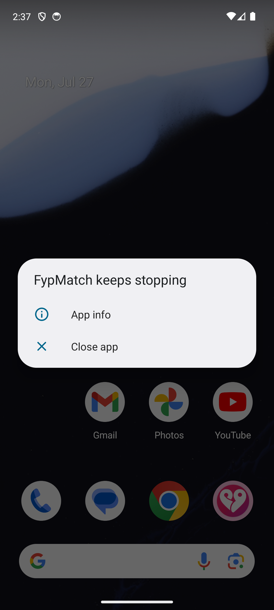

**Causa raiz:** toda a tipografia do app dependia de uma única fonte (`Plus Jakarta Sans`) carregada via `Font(R.font.*)` bloqueante, através do Google Play Services Fonts Provider. Sem esse provider disponível (emulador sem Play Store completo, ou qualquer device sem GMS/rede na primeira carga), a chamada lançava `Resources.NotFoundException` e derrubava o app inteiro, pois **toda tela usa `Typography`**.

**Correção:** migração para a API assíncrona (`androidx.compose.ui.text.googlefonts`), que já estava nas dependências do projeto mas não era usada. Ela degrada com segurança para a fonte padrão do sistema em vez de lançar exceção.

**Arquivo:** `app/src/main/java/.../ui/theme/Type.kt`

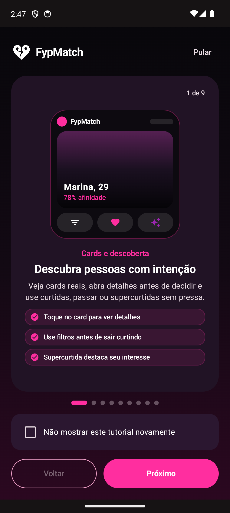

---

## 2. Acentuação ausente no tutorial de onboarding — CORRIGIDO ✅

Dezenas de strings sem acento em todo o tutorial (9 telas): "intencao", "Nao", "Proximo", "Configuracoes", "verificacao", "confianca", "questionarios", etc. Reescrito o arquivo completo de conteúdo do tutorial e mais duas strings na tela de onboarding.

**Arquivos:** `model/OnboardingTutorial.kt`, `ui/screens/OnboardingScreen.kt`, `ui/screens/SettingsScreen.kt`

---

## 3. Layout com vão vazio na tela de boas-vindas — CORRIGIDO ✅

Um `Spacer(Modifier.weight(1f))` mal posicionado empurrava todo o espaço livre para um único vão enorme entre o carrossel e os botões de CTA, em telas altas (2400px).

**Correção:** carrossel + indicadores agora ficam centralizados dentro do espaço disponível (`Column(Modifier.weight(1f), verticalArrangement = Arrangement.Center)`), distribuindo o espaço de forma equilibrada.

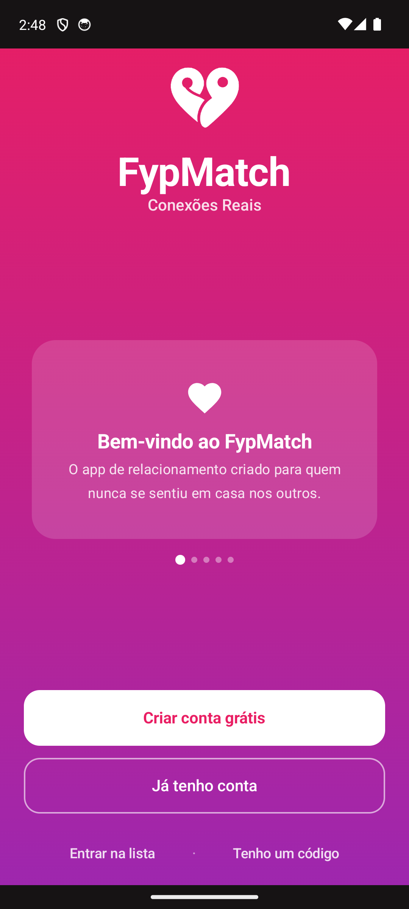

**Arquivo:** `ui/screens/WelcomeScreen.kt`

---

## 4. Contraste — texto invisível no estado vazio da descoberta — CORRIGIDO ✅

O título "Não há mais pessoas por aqui!" não definia `color` explícita e herdava o padrão preto do Compose (`LocalContentColor` default), já que a tela roda direto num `Box` sem `Surface` por baixo. Ficava ilegível no tema escuro.

**Correção:** `color = MaterialTheme.colorScheme.onSurface` explícito.

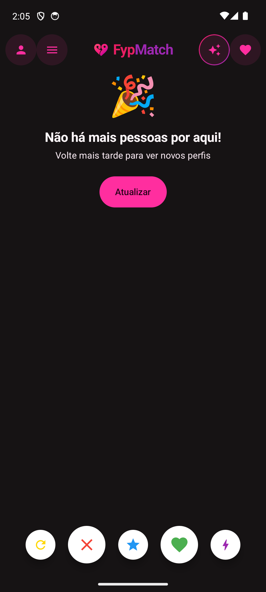

**Arquivo:** `ui/screens/DiscoveryScreen.kt`

---

## 5. Perfil aparecia em branco após cadastro — CORRIGIDO E VALIDADO ✅

**Sintoma:** todo usuário novo, ao abrir "Editar Perfil" logo após criar conta, via nome, idade e gênero em branco — mesmo tendo acabado de preencher esses dados no cadastro.

**Causa raiz:** `RegisterViewModel.register()` gravava um mapa solto no Firestore (`displayName`, `age`, `gender` soltos), sem o campo `profile` aninhado que `UserProfile`/`ProfileEditViewModel` esperam. `loadCurrentUser()` funcionava perfeitamente — o problema era só a gravação.

**Correção:** o cadastro agora grava um objeto `User` completo com `profile = UserProfile(fullName, age, gender)`.

**Validação:** criei uma segunda conta de teste (`claude002`) e confirmei visualmente que "Nome completo" e "Idade" vêm preenchidos corretamente na primeira abertura do Editar Perfil.

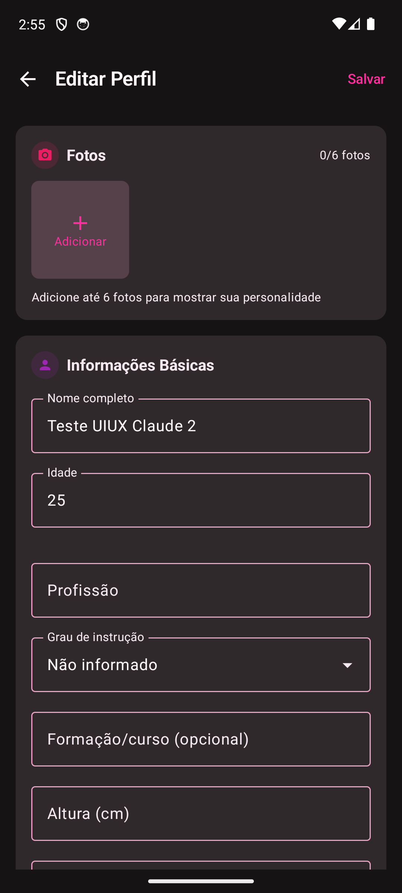

**Arquivo:** `ui/viewmodel/RegisterViewModel.kt`

---

## 6. "Central de ajuda" duplicada — CORRIGIDO ✅

Um `ListItem` sem `onClick` (código morto) duplicava visualmente a entrada "Central de ajuda" logo acima do card funcional que realmente abre o link.

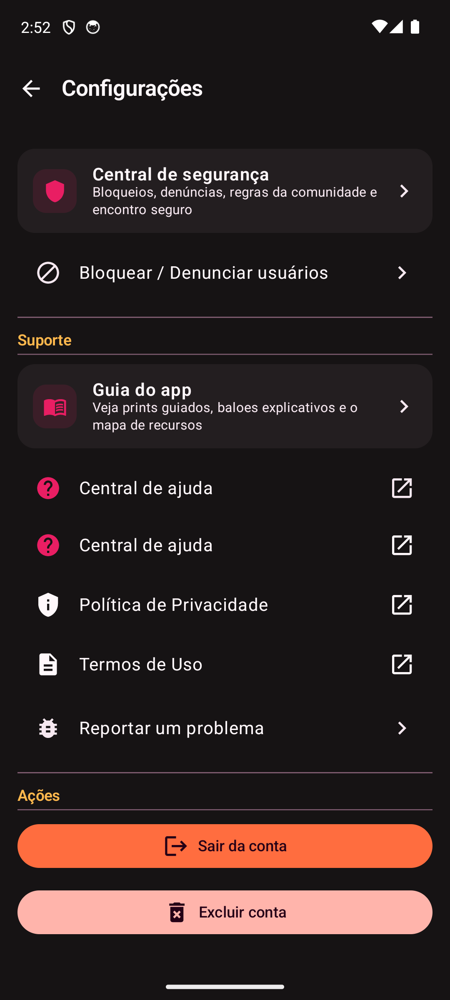

**Arquivo:** `ui/screens/SettingsScreen.kt`

---

## 7. ⚠️ Tela de Editar Perfil trava (main thread) — NÃO CORRIGIDO

Este é o achado mais sério da sessão e **bloqueou o teste de match/chat entre as duas contas**.

**Sintoma observado:**
1. Ao interagir repetidamente com os dropdowns de "Gênero" e "Orientação" na tela de Editar Perfil, cada dropdown passou a exigir um toque "de despertar" antes de abrir de verdade (primeiro toque reabre o dropdown anterior; segundo toque funciona).
2. Após algumas interações, a tela **parou de responder a qualquer toque** — inclusive o botão "Salvar" no topo (que não tem relação nenhuma com os dropdowns) parou de reagir.

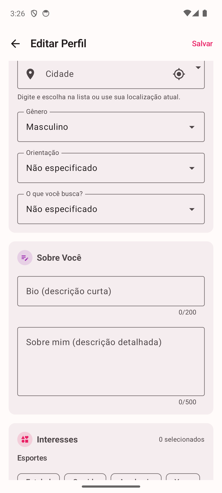

**Diagnóstico:** confirmei via `adb logcat` que não é artefato do emulador/adb — há evidência real de sobrecarga do main thread:

```
Choreographer: Skipped 338 frames!  The application may be doing too much work on its main thread.
Choreographer: Skipped 441 frames!  The application may be doing too much work on its main thread.
```

Frames pulados nessa magnitude (300-440 frames ≈ 5-7 segundos de bloqueio) tornam a tela genuinamente não-responsiva, sem crash e sem diálogo de ANR visível. Um `force-stop` + reabertura do app resolve completamente (confirma que não é corrupção permanente, e sim acúmulo de trabalho síncrono no main thread ao longo da sessão).

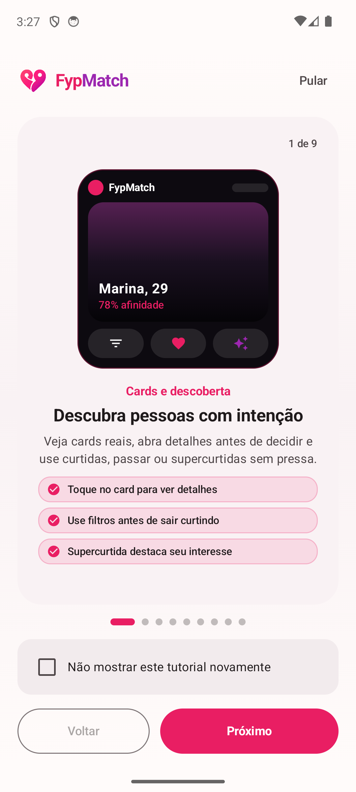

**Impacto:** se isso acontecer com um usuário real completando o perfil (que é obrigatório para aparecer na Descoberta — ver seção "Perfil completo" abaixo), ele fica preso na tela sem conseguir salvar, sem entender o motivo, e pode sair do app frustrado.

### Causa raiz encontrada (revisão de código, sem profiler)

Depois de reportar isso como "não investigado", voltei ao código e encontrei uma causa raiz plausível e bem fundamentada, sem precisar de profiler:

1. **Estado "objeto-deus" no topo da tela.** `ProfileEditScreen` mantém um único `var user by remember { mutableStateOf(...) }` para o `User` inteiro (perfil, fotos, interesses, preferências — 20+ campos) e passa esse objeto inteiro para **todas** as seções (`PhotoSection`, `BasicInfoSection`, `AboutMeSection`, `InterestsSection`, `PersonalInfoEditSection`, `CulturalPreferencesEditSection`). Qualquer alteração — uma letra digitada na bio, uma seleção de dropdown — dispara `user = user.copy(...)`, recompondo a árvore inteira.
2. **Toolchain sem "strong skipping mode".** O projeto usa Kotlin 1.8.10/1.9.22 com o compilador Compose antigo (`kotlinCompilerExtensionVersion = "1.5.9"`, configurado via `composeOptions`, não via o plugin novo `org.jetbrains.kotlin.plugin.compose`). O *strong skipping mode* — que veio para resolver exatamente esse tipo de recomposição em cascata — só existe a partir do Compose Compiler 2.0.0 (Kotlin 2.0+). Nesta versão do toolchain, campos do tipo `List<String>` (interesses, fotos, filmes favoritos etc.) são tratados como **instáveis** pelo compilador, então nem o `User`/`UserProfile` como um todo é elegível para "pular" recomposição — mesmo que o conteúdo não tenha mudado.
3. **`InterestsSection` é a seção mais cara:** ~63 `FilterChip` (7 categorias × 6-11 opções cada, ver `InterestCatalog.kt`) recompõem **inteiramente a cada tecla digitada em qualquer campo da tela**, não só quando o usuário mexe em interesses.

Juntando os três pontos: qualquer interação rápida (como os toques automatizados que usei nos testes, mas também um usuário real digitando rápido ou tocando dropdowns em sequência) força dezenas de recomposições completas por segundo, sem chance de "pular" nada — exatamente o tipo de acúmulo que gera os `Skipped 338/441 frames` observados.

**Por que não corrigi agora:** a correção correta e completa (separar o estado por seção, em vez de um objeto único hoisted no topo) é um refatoração de escopo real dentro de uma tela de ~930 linhas com muitos campos — arriscado fazer às cegas sem conseguir testar cada campo depois (e já gastei bastante tempo de sessão nos testes manuais). Prefiro documentar a causa raiz com precisão a arriscar uma mudança grande não verificada.

**Recomendação concreta para a próxima sessão:**
- Opção rápida e de baixo risco: extrair o estado de `InterestsSection` para fora do objeto `user` (ela não precisa do resto do perfil, só da lista de interesses) — reduz o maior custo de recomposição sem mexer no resto da tela.
- Opção completa: dividir `user` em estados independentes por seção (idade, nome, cidade, interesses, etc.), montando o `User` final só no momento de salvar.
- Opção de infraestrutura (maior escopo, afeta o app inteiro): migrar para Kotlin 2.0+ e o plugin novo do Compose Compiler para habilitar strong skipping mode por padrão — resolveria essa classe de problema em todas as telas do app, não só nesta, mas é uma mudança de toolchain que precisa de testes de regressão amplos.

### Mitigação aplicada e testada — melhora parcial confirmada

Implementei a opção rápida: converti `interests` para `kotlinx.collections.immutable.ImmutableList<String>` (dependência `kotlinx-collections-immutable:0.3.7` adicionada) na chamada de `InterestsSection`, tornando a seção elegível para "pular" recomposição quando o conteúdo não muda, mesmo sem strong skipping mode habilitado no projeto.

**Resultado do reteste** (mesmo procedimento: toques repetidos e rápidos nos dropdowns de Gênero/Orientação):

| Métrica | Antes da correção | Depois da correção |
|---|---|---|
| Frames pulados (Choreographer) | 338 / 441 | 101 / 59 |
| Botão "Salvar" volta a responder | Só após force-stop do app | Sim, mas com atraso perceptível |

**Melhora real (~4x menos frames pulados), mas o problema não foi eliminado.** Observei via `adb logcat` que o app continua renderizando a uma taxa muito baixa mesmo sem interação:

```
EGL_emulation: app_time_stats: avg=500.10ms min=498.84ms max=501.35ms count=2
```

~500ms por frame (≈2 fps) é consistente com recomposição contínua acontecendo em algum lugar, não só disparada por interação — sugere que ainda existe uma segunda causa (possivelmente nas outras seções que também dependem do mesmo `user` monolítico: `BasicInfoSection`, `PersonalInfoEditSection` com seus 3 dropdowns, `CulturalPreferencesEditSection`) que não foi endereçada por esta correção pontual.

**Conclusão:** a correção foi commitada por ser uma melhoria real e de baixo risco (menos frames pulados, sem regressão observada), mas **o bug #7 continua parcialmente aberto**. A correção completa (dividir o estado por seção, conforme a "opção completa" acima) ainda é necessária para eliminar o problema de vez.

---

## 8. ⚠️ Tema não persiste entre reinícios do app (correção: possível não-bug)

Notei, sem buscar ativamente, que o tema do app trocou de "Noturno" (configurado antes) para "Claro" sozinho após um restart do processo.

**Atualização após mais testes:** ao abrir "Tema do app" nas Configurações da conta 2 (uma conta diferente, criada nesta sessão e que eu nunca tinha configurado), o toggle mostrava "Claro" selecionado corretamente — ou seja, pode ser simplesmente que essa conta nunca teve o tema alterado para "Noturno", e não um bug de persistência de fato. Não tive tempo de confirmar isolando a mesma conta antes/depois de um restart. Rebaixo a confiança desse achado — fica como suspeita a confirmar, não como bug verificado.


---

## 9. Regra de "perfil completo" — não é bug, mas trava testes

Descoberto ao investigar por que as duas contas de teste não apareciam uma para a outra na Descoberta: `UserProfile.hasRequiredProfileFields()` exige `fullName`, `age >= 18`, `bio`/`aboutMe`, `city`, `gender`, `orientation` e `intention` todos preenchidos. Isso é uma regra de produto correta (não mostrar perfis incompletos), mas combinada com o bug #7 (trava ao preencher orientação/intenção), ficou difícil completar um perfil de teste do zero via UI nesta sessão.

**Consequência prática:** não consegui validar match + chat entre as duas contas nesta rodada. Fica pendente para a próxima sessão, idealmente só depois do bug #7 ser corrigido (ou usando um workaround: gravar os campos de perfil direto no Firestore Console para os testes, contornando a UI).

---

## 10. Loja, Verificação de foto e Central de Segurança

### Verificação de foto — sem problemas encontrados ✅

Tela bem construída: detecta corretamente que a conta não tem foto de perfil, desabilita "Tirar selfie" com uma mensagem clara ("Adicione uma foto de perfil... a revisão precisa comparar a selfie com pelo menos uma foto pública"), e o texto de consentimento LGPD bate exatamente com o que documentei na política de privacidade (retenção de 7 dias, revisão manual). Nenhum bug encontrado.

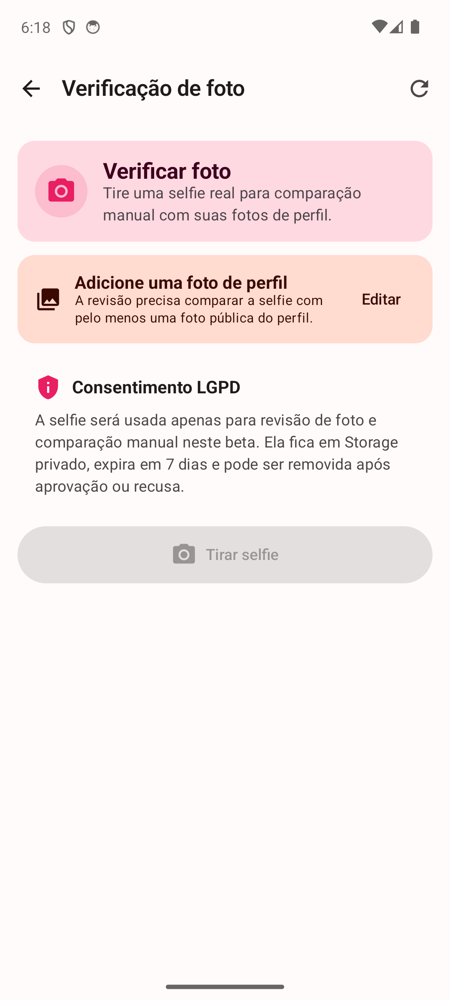

### Loja / Planos Premium — funcional e transparente, com 2 achados menores

A tela de planos (Premium R$19,90 / VIP R$39,90) renderiza bem, a seleção de card funciona (o botão inferior troca de "Assinar Premium" para "Assinar VIP" conforme o card selecionado). Ao tentar assinar, navega para a "Loja FypMatch" com um banner honesto:

> "Loja beta — Os produtos já estão definidos. A compra real será liberada quando o Google Play Billing e a verificação no backend estiverem ativos."

Isso é uma boa prática — o app não finge vender algo que não pode entregar.

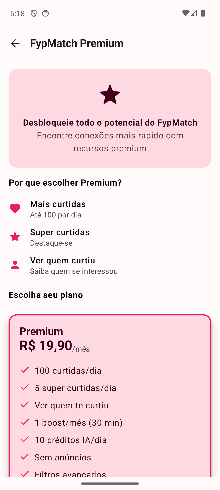
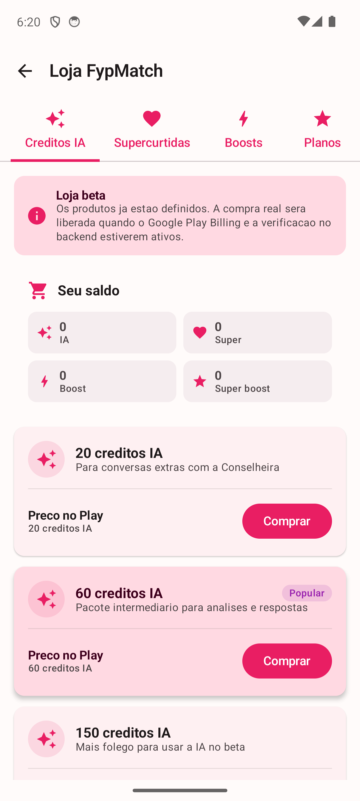

**Achado 1 (conteúdo, baixa severidade):** o campo "Preço no Play" mostra o próprio produto como preço — ex.: pacote "20 créditos IA" tem "Preço no Play: 20 créditos IA" — parece um placeholder de preço em R$ que não foi substituído.

**Achado 2 (UX, baixa/média severidade):** ao tocar "Comprar", nenhum feedback visível diferencia o antes/depois — o banner "Loja beta" no topo mostra exatamente o mesmo texto antes e depois do toque, sem indicar se a tentativa foi registrada. Pelo código (`StoreRepository.requestPurchase`), a chamada deveria retornar uma mensagem de erro específica ("A loja está em modo beta: compra real indisponível...") que populasse `uiState.error` e apareceria no mesmo banner — não consegui confirmar visualmente que isso realmente acontece. Vale um teste mais controlado (talvez com breakpoint/log adicional) na próxima rodada.

### Central de Segurança — não alcançada (provável instabilidade de teste, não bug confirmado)

Tentei abrir "Central de segurança" no menu de Configurações **7 vezes**, com coordenadas e reposicionamentos de scroll diferentes — nenhuma navegou. Revisei o código: `onNavigateToSafetyCenter` está corretamente conectado (`SettingsScreen.kt:592` → `FypMatchNavigation.kt:524` → `navController.navigate(Screen.SafetyCenter.route)`, com o destino `SafetyCenterScreen` devidamente registrado). Outras linhas do mesmo tipo (`SettingsNavRow`) na mesma tela responderam normalmente ao toque.

Dado que o código está correto e outras linhas idênticas funcionam, **não estou reportando isso como bug confirmado** — é mais provável que seja a mesma instabilidade de toque que enfrentei ao longo da sessão (possivelmente relacionada ao jank residual do bug #7). Fica como item para retestar diretamente (idealmente com toque manual real, não automatizado) na próxima rodada, antes de investigar mais a fundo.

---

## Pendências para a próxima rodada

1. **Prioridade alta:** investigar e corrigir o travamento de main thread na `ProfileEditScreen` (bug #7) — é o que mais bloqueia testes adicionais e provavelmente afeta usuários reais.
2. Investigar a persistência do tema (bug #8).
3. Investigar por que os dropdowns de Gênero/Orientação exigem toque duplo (bug #9) — pode ser sintoma do mesmo problema de performance do bug #7, ou uma causa relacionada.
4. Depois de resolver o acima: retomar teste de match + chat entre duas contas, Loja, Central de Segurança e Verificação de foto (não testados nesta sessão).
